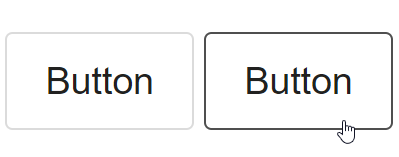
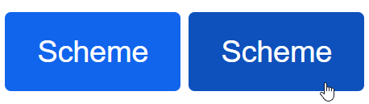
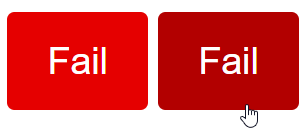
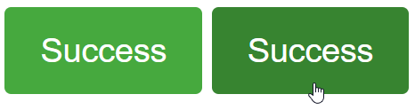
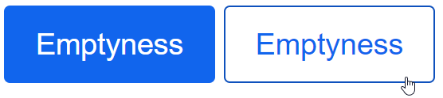

# SassDesk

SassDesk is a SCSS library thought to fasten the UI develoing process providing a set of modular styles.

**SassDesk is a project currently being developed** and so we encourage our users to download and check all the flexible styles we provide. 

## Download

`npm i sassdesk`

## Buttons
SassDesk provides a set of classes to style buttons. The base class is: "button". This is its styling:



```html
<button class="button">Button</button>
```

Also, SassDesk provides a set of colored buttons which are defined by a variable called *$color-pairs* in the "secondary-variables" file. These pairs define the color of the name of the class (`string`) and the color pair which is the background color and font color. Here are some examples:


```html
<button class="button scheme">Scheme</button>
```


```html
<button class="button fail">Fail</button>
```


```html
<button class="button success">Success</button>
```

For all of these colored classes we can add *isEmpty* to edit the hover effect:


```html
<button class="button scheme isEmpty">Emptyness</button>
```

### Try it!